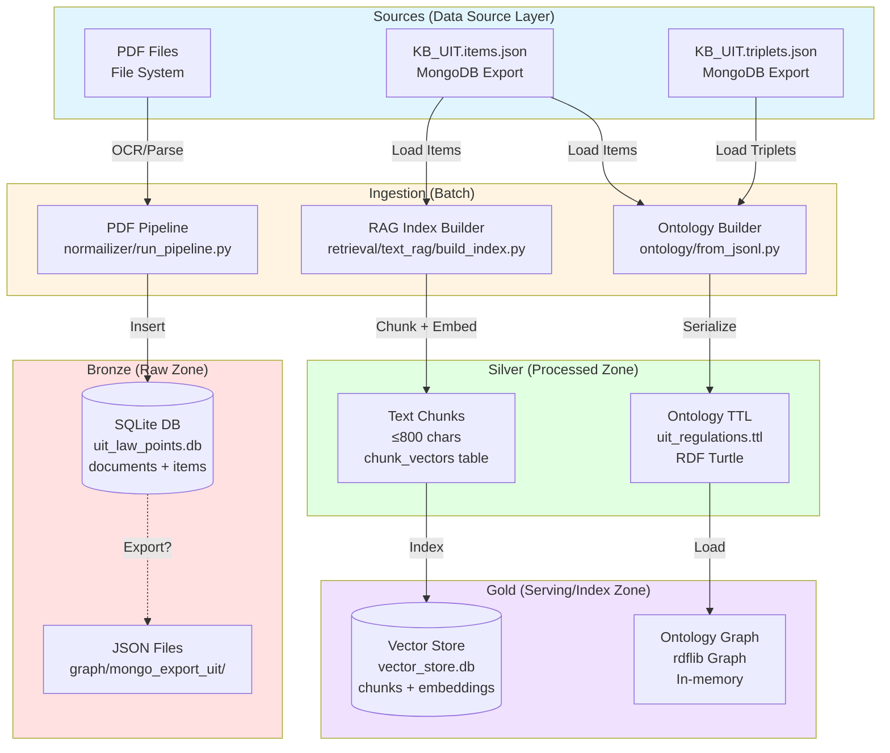
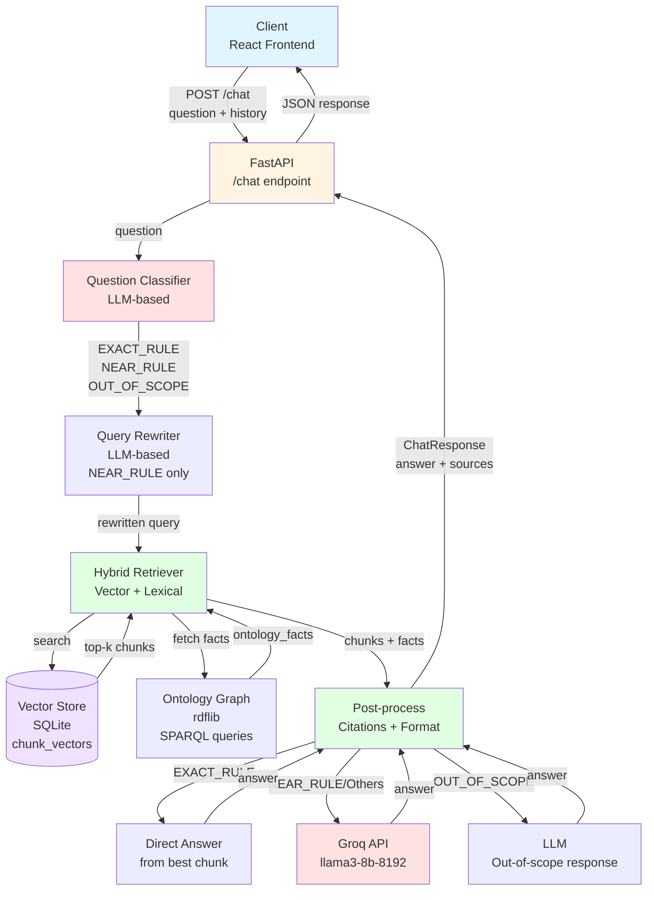

# BÁO CÁO PIPELINE BIGDATA - UIT CHATBOT

**Tác giả:** BigData Architect + Technical Writer  
**Ngày:** 2024  
**Project:** UIT Chatbot - Hệ thống RAG (Retrieval-Augmented Generation) cho quy chế đào tạo UIT

---

## 0. QUY TẮC BẮT BUỘC

- ✅ Chỉ mô tả những gì có trong code/config thật
- ✅ Mỗi khẳng định kèm Evidence: đường dẫn file + 1-2 keyword
- ✅ Nếu thiếu thông tin → ghi "Chưa thấy trong repo" + gợi ý

---

## 1. DATA PRODUCTS & SERVICES

### 1.1 Kiến trúc tổng quan

**Đây là mono-repo** với các module/service sau:

- **Backend API** (FastAPI): Service xử lý chat, classification, RAG retrieval
- **Frontend Web** (React + TypeScript): UI client cho chatbot
- **Ontology Builder**: Module chuyển đổi JSON → RDF/OWL (Turtle)
- **RAG Index Builder**: Module xây dựng vector index từ JSON items
- **Normalizer Pipeline**: Module xử lý PDF → SQLite (standalone, có thể tách riêng)

**Evidence:**
- `backend/api/main.py`: FastAPI app, endpoint `/chat`
- `web/src/App.tsx`: React frontend
- `ontology/from_jsonl.py`: build_graph function
- `retrieval/text_rag/build_index.py`: main() function
- `normailizer/src/run_pipeline.py`: process_pdf function

### 1.2 Data Products chính

1. **Documents** (Raw): PDF files → SQLite DB (normailizer module)
   - Evidence: `normailizer/src/import_to_db.py`: insert_document function

2. **Items JSON** (Content/Hierarchy): `KB_UIT.items.json` chứa article/clause với metadata
   - Evidence: `graph/mongo_export_uit/KB_UIT.items.json`: file tồn tại
   - Evidence: `retrieval/text_rag/load_from_jsonl.py`: iter_raw_docs function

3. **Triplets JSON** (Graph): `KB_UIT.triplets.json` chứa subject-relation-object triples
   - Evidence: `graph/mongo_export_uit/KB_UIT.triplets.json`: file tồn tại
   - Evidence: `ontology/from_jsonl.py`: _add_triplets function

4. **Chunks** (Processed): Text chunks ≤800 chars với embeddings
   - Evidence: `retrieval/text_rag/chunker.py`: chunk_document, max_chars=800
   - Evidence: `retrieval/text_rag/vector_store.py`: chunk_vectors table

5. **Embeddings** (Vector): Float32 vectors từ sentence-transformers
   - Evidence: `retrieval/text_rag/embeddings.py`: TextEmbedder, model="keepitreal/vietnamese-sbert"
   - Evidence: `retrieval/text_rag/vector_store.py`: embedding BLOB column

6. **Ontology Graph** (RDF): Turtle file chứa triples
   - Evidence: `ontology/uit_regulations.ttl`: output file
   - Evidence: `ontology/from_jsonl.py`: graph.serialize(format="turtle")

7. **Chat Logs**: Chưa thấy trong repo (không có persistence layer cho conversation history)
   - Gợi ý: Thêm table `chat_sessions`, `chat_messages` trong SQLite hoặc MongoDB

8. **Feedback**: Chưa thấy trong repo
   - Gợi ý: Thêm endpoint `/feedback` với schema rating, comment, question_id

---

## 2. PIPELINE THEO CHUẨN BIGDATA

### 2.1 Sources (Data Source Layer)

#### Mục tiêu
Thu thập dữ liệu từ các nguồn: PDF documents, MongoDB exports (JSON), và có thể từ API (chưa thấy).

#### Input

1. **PDF Documents** (Raw source)
   - Location: `normailizer/` module xử lý PDF files
   - Format: PDF (scan hoặc digital)
   - Evidence: `normailizer/src/run_pipeline.py`: `--pdf` hoặc `--pdf_dir` argument

2. **MongoDB Exports** (Pre-processed JSON)
   - `graph/mongo_export_uit/KB_UIT.items.json`: Content/hierarchy export
   - `graph/mongo_export_uit/KB_UIT.triplets.json`: Graph/triplet export
   - Evidence: `graph/mongo_export_uit/`: directory tồn tại với 2 file JSON

3. **Demo/Seed Data**: Chưa thấy folder `data/` hoặc `seed/` rõ ràng
   - Gợi ý: Tạo `data/demo/` với sample PDFs và JSON

#### Process
- PDF ingestion: `normailizer/src/run_pipeline.py` → OCR/text extraction → parse structure
- JSON ingestion: Direct file read (không có streaming API)

#### Output
- PDF → SQLite DB: `normailizer/uit_law_points.db`
- JSON → In-memory objects (chưa có intermediate storage rõ)

#### Storage/Tech used
- **Bronze (Raw)**: 
  - PDF files: File system (chưa có object storage như S3)
  - JSON files: `graph/mongo_export_uit/` directory
  - Evidence: `normailizer/src/import_to_db.py`: sha256_file checksum, documents table

#### Failure handling
- PDF: Try text layer first, fallback OCR
  - Evidence: `normailizer/src/ocr_text.py`: extract_text_layer → ocr_folder fallback
- JSON: Exception handling trong iterators
  - Evidence: `ontology/from_jsonl.py`: _iter_json_objects với try/except

**Evidence:**
- `normailizer/src/run_pipeline.py`: process_pdf function
- `graph/mongo_export_uit/KB_UIT.items.json`: file path
- `normailizer/src/import_to_db.py`: sha256_file, duplicate detection

---

### 2.2 Ingestion (Batch/Incremental/Streaming)

#### Mục tiêu
Chuyển đổi raw data thành structured format, có deduplication và metadata extraction.

#### Input
- PDF files hoặc JSON files từ Sources

#### Process (steps)

1. **PDF Ingestion** (Batch, manual trigger)
   - Command: `python normailizer/src/run_pipeline.py --pdf_dir ./pdfs --db uit_law.db`
   - Steps:
     - PDF → PNG (render pages)
     - PNG → Text (OCR hoặc text layer)
     - Text → Structured (parse Chương/Điều/Khoản/Điểm)
     - Insert vào SQLite với dedup (checksum)
   - Evidence: `normailizer/src/run_pipeline.py`: main() với argparse

2. **JSON Ingestion** (Batch, manual trigger)
   - Command: `python -m ontology.from_jsonl` (cho ontology)
   - Command: `python -m retrieval.text_rag.build_index` (cho RAG index)
   - Steps:
     - Load JSON array/JSONL
     - Parse items/triplets
     - Transform to target format (RDF hoặc chunks)
   - Evidence: `ontology/from_jsonl.py`: main() function
   - Evidence: `retrieval/text_rag/build_index.py`: main() function

3. **Deduplication**
   - PDF: SHA256 checksum trong `documents` table
     - Evidence: `normailizer/src/import_to_db.py`: sha256_file, checksum check
   - Chunks: `INSERT OR REPLACE` trong vector store
     - Evidence: `retrieval/text_rag/vector_store.py`: INSERT OR REPLACE

4. **Metadata Extraction**
   - PDF: Extract so_hieu, title từ filename hoặc override
     - Evidence: `normailizer/src/run_pipeline.py`: infer_meta_from_filename
   - JSON: Extract _id, doc_id, parent_id, level, title, heading, content
     - Evidence: `retrieval/text_rag/load_from_jsonl.py`: RawRegulationDoc TypedDict

5. **Versioning**: Chưa thấy versioning rõ (không có timestamp version cho documents)
   - Gợi ý: Thêm `version` column trong documents table, hoặc `updated_at` tracking

#### Output
- PDF → SQLite: documents, items, sources tables
- JSON → RDF TTL: `ontology/uit_regulations.ttl`
- JSON → Vector DB: `retrieval/text_rag/vector_store.db`

#### Storage/Tech used
- SQLite (FTS5): `normailizer/uit_law_points.db`
- SQLite (vector store): `retrieval/text_rag/vector_store.db`
- Turtle file: `ontology/uit_regulations.ttl`

#### Failure handling
- PDF: Exception trong OCR → return empty string
  - Evidence: `normailizer/src/ocr_text.py`: try/except trong ocr_folder
- JSON: Skip invalid lines, log warnings
  - Evidence: `ontology/from_jsonl.py`: continue nếu subject_id/object_id missing
- Vector indexing: Batch processing với error handling
  - Evidence: `retrieval/text_rag/build_index.py`: batch size 128, try/except

**Evidence:**
- `normailizer/src/run_pipeline.py`: argparse, process_pdf
- `normailizer/src/import_to_db.py`: checksum dedup
- `retrieval/text_rag/build_index.py`: batch indexing

---

### 2.3 Storage (Bronze/Silver/Gold theo BigData)

#### Mục tiêu
Phân tầng storage theo data quality và use case.

#### Bronze (Raw zone)

**Location:**
- PDF files: File system (chưa có object storage)
- JSON exports: `graph/mongo_export_uit/KB_UIT.items.json`, `KB_UIT.triplets.json`
- SQLite raw: `normailizer/uit_law_points.db` (documents + items tables)

**Schema:**
- `documents`: id, so_hieu, title, checksum, created_at
- `items`: id, doc_id, parent_id, level, title, heading, content, ordinal, path
- Evidence: `normailizer/src/schema.sql`: CREATE TABLE statements (file được reference)

#### Silver (Processed zone)

**Location:**
- Normalized text chunks: `retrieval/text_rag/vector_store.db` (chunk_vectors table)
- Structured ontology: `ontology/uit_regulations.ttl` (RDF Turtle)

**Schema:**
- `chunk_vectors`: chunk_id, article_id, clause_id, text, metadata_json, embedding (BLOB)
- RDF triples: Article, Clause, Entity nodes với properties (uit:title, uit:fullText, uit:hasParent, ...)
- Evidence: `retrieval/text_rag/vector_store.py`: CREATE TABLE chunk_vectors
- Evidence: `ontology/from_jsonl.py`: graph.add() với SC.Article, SC.Clause, SC.title, SC.fullText

**Transformation:**
- Text normalization: Sentence splitting, chunking ≤800 chars
  - Evidence: `retrieval/text_rag/chunker.py`: chunk_document, max_chars=800
- Metadata enrichment: article_id, clause_id, title, section
  - Evidence: `retrieval/text_rag/chunker.py`: metadata dict với title, section

#### Gold (Serving/Index zone)

**Location:**
- Vector index: `retrieval/text_rag/vector_store.db` (chunk_vectors với embeddings)
- Ontology index: `ontology/uit_regulations.ttl` (loaded vào rdflib Graph in-memory)
- Evidence: `backend/llm/orchestrator.py`: ChunkVectorStore, load_ontology

**Schema:**
- Vector store: Same as Silver (chunk_vectors) nhưng có embeddings populated
- Ontology: RDF Graph với SPARQL query support
  - Evidence: `ontology/loader.py`: run_sparql, get_article_by_id

**Indexing:**
- Vector: Cosine similarity search (numpy dot product)
  - Evidence: `retrieval/text_rag/vector_store.py`: _search_vector với np.dot
- Text fallback: SQL LIKE search (khi embedding disabled)
  - Evidence: `retrieval/text_rag/vector_store.py`: _search_text_only với LIKE
- Ontology: SPARQL queries
  - Evidence: `ontology/loader.py`: SPARQL SELECT queries

**Note:** Không có phân tầng rõ ràng Bronze/Silver/Gold riêng biệt về storage location, nhưng có phân tầng về data quality:
- Bronze: Raw PDF/JSON
- Silver: Processed chunks (chưa có embedding)
- Gold: Indexed chunks (có embedding) + Ontology graph

**Evidence:**
- `retrieval/text_rag/vector_store.py`: chunk_vectors table schema
- `ontology/uit_regulations.ttl`: output file
- `backend/llm/orchestrator.py`: vector_store, ontology_graph initialization

---

### 2.4 Processing (ETL/ELT)

#### Mục tiêu
Cleaning, normalization, chunking, embedding generation.

#### Input
- Raw text từ PDF hoặc JSON items

#### Process (steps)

1. **Text Cleaning/Normalization**
   - PDF: OCR text cleaning (chưa thấy explicit cleaning step)
   - JSON: Direct use (assume already clean)
   - Vietnamese normalization: Lowercase, remove accents (NFD + filter Mn) cho keyword matching
     - Evidence: `backend/llm/orchestrator.py`: _normalize_vietnamese function

2. **Chunking Strategy**
   - **Size-based**: Max 800 chars per chunk (configurable via `UIT_CHUNK_MAX_CHARS`)
   - **Overlap**: Không có overlap (hard split tại sentence boundary)
   - **Heading-based**: Parse structure (Chương/Điều/Khoản) nhưng không dùng để chunk
   - **Sentence splitting**: Regex `(?<=[.!?])\s+` để split sentences
   - Evidence: `retrieval/text_rag/chunker.py`: chunk_document, _split_sentences
   - Evidence: `retrieval/text_rag/build_index.py`: max_chars = int(os.getenv("UIT_CHUNK_MAX_CHARS", "800"))

3. **Metadata Enrichment Schema**
   - Fields: article_id, clause_id, title, section (heading)
   - Evidence: `retrieval/text_rag/chunker.py`: TextChunk TypedDict với metadata dict

4. **Embedding Generation**
   - **Model**: `keepitreal/vietnamese-sbert` (SentenceTransformer)
   - **Dimension**: Không thấy explicit (mặc định của model)
   - **Batch size**: Mặc định của sentence-transformers (không override)
   - **Normalization**: `normalize_embeddings=True`
   - **Dtype**: float32
   - Evidence: `retrieval/text_rag/embeddings.py`: SentenceTransformer, embed() với normalize_embeddings=True
   - Evidence: `retrieval/text_rag/embeddings.py`: model_name từ env `UIT_RAG_MODEL`

5. **OCR Pipeline** (nếu PDF scan)
   - PDF → PNG: PyMuPDF render (DPI 220, configurable)
   - PNG → Text: Tesseract OCR (lang: vie+eng)
   - Fallback: Text layer extraction nếu digital PDF
   - Evidence: `normailizer/src/pdf2png.py`: pdf_to_pngs (reference trong ocr_text.py)
   - Evidence: `normailizer/src/ocr_text.py`: extract_text_layer → ocr_folder fallback
   - Evidence: `normailizer/src/config.py`: RENDER_DPI=220, OCR_LANG="vie+eng"

6. **Structure Parsing** (PDF)
   - Regex-based: Parse Chương, Điều, Khoản, Điểm
   - Evidence: `normailizer/src/parse_structure.py`: CHAPTER_RE, ARTICLE_RE, KHOAN_RE, DIEM_RE

#### Output
- Chunks với embeddings (float32 numpy arrays)
- Metadata-enriched chunks trong vector store

#### Storage/Tech used
- SentenceTransformers: `sentence-transformers>=2.2.0`
- NumPy: `numpy>=1.24.0`
- Tesseract OCR: External binary
- PyMuPDF (fitz): PDF rendering

#### Failure handling
- Embedding: Exception → skip chunk (chưa thấy explicit error handling)
- OCR: Exception → return empty string
  - Evidence: `normailizer/src/ocr_text.py`: try/except trong ocr_folder

**Evidence:**
- `retrieval/text_rag/chunker.py`: chunk_document, max_chars
- `retrieval/text_rag/embeddings.py`: TextEmbedder class
- `normailizer/src/ocr_text.py`: pdf_to_text với fallback

---

### 2.5 Indexing (Vector/Hybrid Index)

#### Mục tiêu
Xây dựng index cho fast retrieval: vector similarity + lexical search.

#### Input
- Chunks với embeddings từ Processing

#### Process (steps)

1. **Vector Store**
   - **Technology**: SQLite với BLOB column cho embeddings
   - **Index type**: Full table scan với cosine similarity (không có HNSW/FAISS)
   - **Upsert strategy**: `INSERT OR REPLACE` (idempotent)
   - Evidence: `retrieval/text_rag/vector_store.py`: ChunkVectorStore, index_chunks với INSERT OR REPLACE

2. **Hybrid Index** (Vector + Lexical)
   - **Vector search**: Cosine similarity (numpy dot product)
   - **Lexical search**: SQL LIKE (khi embedding disabled) hoặc keyword matching (khi enabled)
   - **Combination**: Weighted score = embedding_score + 0.75 * lexical_score + 1.0 * domain_score
   - Evidence: `backend/llm/orchestrator.py`: _hybrid_retrieve, _compute_hybrid_lexical_score

3. **BM25/Hybrid**: Chưa thấy BM25 implementation
   - Gợi ý: Thêm BM25 index cho text column (SQLite FTS5 hoặc external library)

4. **Index Refresh/Cold Start**
   - **Cold start**: Auto-build nếu vector_store empty (on startup)
     - Evidence: `backend/llm/orchestrator.py`: _ensure_vector_store_loaded
   - **Refresh**: Manual trigger (chạy lại `build_index.py`)
   - **Incremental**: Chưa thấy (không có timestamp-based incremental update)

5. **Re-ranking**
   - **Keyword-aware reranking**: Cho EXACT_RULE questions
   - **Scoring**: combined_score = original_score + 1.0 * lexical_score
   - **Keywords**: Domain keywords (tín chỉ, cảnh báo, tốt nghiệp, ...) + numbers
   - Evidence: `backend/llm/orchestrator.py`: _rerank_chunks_by_keywords, _extract_keywords

#### Output
- Indexed vector store: `retrieval/text_rag/vector_store.db`
- In-memory ontology graph: rdflib Graph object

#### Storage/Tech used
- SQLite: Vector store backend
- NumPy: Cosine similarity computation
- rdflib: Ontology graph + SPARQL

#### Failure handling
- Index build: Batch processing với error handling
  - Evidence: `retrieval/text_rag/build_index.py`: batch size 128, try/except
- Search: Fallback to text-only nếu embedding disabled
  - Evidence: `retrieval/text_rag/vector_store.py`: _search_text_only fallback

**Evidence:**
- `retrieval/text_rag/vector_store.py`: ChunkVectorStore class
- `backend/llm/orchestrator.py`: _hybrid_retrieve, _rerank_chunks_by_keywords
- `retrieval/text_rag/build_index.py`: batch indexing

---

### 2.6 Serving (Online Query Pipeline)

#### Mục tiêu
Xử lý câu hỏi real-time, retrieval, LLM generation, response formatting.

#### Input
- User question (string) + optional conversation_history

#### Process (steps)

1. **Endpoint chính**
   - `/chat` (POST): Nhận ChatRequest, trả ChatResponse
   - Evidence: `backend/api/main.py`: @app.post("/chat")

2. **Query Preprocessing**
   - **Intent classification**: LLM-based classifier (EXACT_RULE, NEAR_RULE, OUT_OF_SCOPE)
     - Evidence: `backend/llm/question_classifier.py`: classify_question
   - **Query rewriting**: Cho NEAR_RULE questions (informal → formal)
     - Evidence: `backend/llm/orchestrator.py`: _rewrite_query_for_regulations
   - **Multi-turn context**: Combine với conversation_history nếu có discourse markers
     - Evidence: `backend/llm/orchestrator.py`: _build_retrieval_query_async với discourse_markers
   - **Language/Guardrails**: Chưa thấy explicit language detection hoặc guardrails
     - Gợi ý: Thêm language detection, content filter (toxicity, PII)

3. **Retrieval**
   - **Top-k**: Default 5 (configurable via `UIT_RAG_TOP_K`)
   - **Candidate pool**: 6x top_k cho EXACT_RULE (configurable via `UIT_RAG_EXACT_RULE_CANDIDATES`)
   - **Hybrid retrieval**: Vector + lexical + domain scoring
     - Evidence: `backend/llm/orchestrator.py`: _hybrid_retrieve
   - **Filtering**: Chưa thấy explicit filtering (theo date, doc_id, ...)
     - Gợi ý: Thêm metadata filters (doc_id, date range)

4. **Fallback Retrieval**
   - **Lexical fallback**: Nếu EXACT_RULE không có keyword hit trong vector results
     - Evidence: `backend/llm/orchestrator.py`: _lexical_retrieve_from_kb
   - **KB items cache**: Lazy-loaded từ `KB_UIT.items.json`
     - Evidence: `backend/llm/orchestrator.py`: _load_kb_items, _kb_items_cache

5. **Prompt Assembly**
   - **Context building**: Chunks + ontology_facts
     - Evidence: `backend/llm/orchestrator.py`: _build_context
   - **System prompts**: Khác nhau cho EXACT_RULE, NEAR_RULE, OUT_OF_SCOPE
     - Evidence: `backend/llm/prompts.py`: ANSWER_SYSTEM_PROMPT, OUT_OF_SCOPE_SYSTEM_PROMPT
   - **Conversation history**: Append vào context nếu có
     - Evidence: `backend/llm/orchestrator.py`: answer_question với conversation_history

6. **LLM Call**
   - **Provider**: Groq API
   - **Model**: `llama3-8b-8192` (default, configurable via `GROQ_MODEL`)
   - **Temperature**: 0.2 (hardcoded)
   - **Format**: OpenAI-compatible chat format (system + user messages)
   - Evidence: `groq_client.py`: call_groq_llm với temperature=0.2
   - Evidence: `backend/llm/client.py`: LLMClient.generate

7. **Post-processing**
   - **EXACT_RULE**: Direct answer từ best chunk (không gọi LLM)
     - Evidence: `backend/llm/orchestrator.py`: _answer_exact_rule
   - **NEAR_RULE/Others**: LLM-generated answer
   - **Citations**: Extract article_id, clause_id, text từ chunks
     - Evidence: `backend/api/main.py`: sources = [Source(article_id=..., clause_id=..., text=...)]
   - **Debug logging**: RAG-DEBUG logs với chunk details
     - Evidence: `backend/llm/orchestrator.py`: _log_chunks, logger.debug

#### Output
- **Response schema**: ChatResponse với answer, question_type, sources
  - Evidence: `backend/api/schemas.py`: ChatResponse class

#### Storage/Tech used
- FastAPI: Web framework
- Groq API: LLM provider
- SQLite: Vector store query
- rdflib: Ontology query

#### Failure handling
- LLM API: HTTP error handling, timeout 60s
  - Evidence: `groq_client.py`: try/except requests.HTTPError, timeout=60
- Retrieval: Empty results → return empty sources
  - Evidence: `backend/llm/orchestrator.py`: if not chunks: return []
- Classification: Fallback to NEAR_RULE nếu parsing fails
  - Evidence: `backend/llm/question_classifier.py`: except: return QuestionType.NEAR_RULE

**Evidence:**
- `backend/api/main.py`: /chat endpoint
- `backend/llm/orchestrator.py`: answer_question, _hybrid_retrieve
- `groq_client.py`: call_groq_llm

---

### 2.7 Monitoring & Governance (BigData ops)

#### Mục tiêu
Logging, metrics, tracing, data lineage, access control.

#### Logging

1. **Location & Format**
   - **Backend**: Python logging với format `%(asctime)s [%(levelname)s] %(name)s - %(message)s`
   - **Level**: DEBUG (configurable)
   - **Output**: Console (chưa thấy file logging hoặc centralized logging)
   - Evidence: `backend/llm/orchestrator.py`: logging.basicConfig với format string
   - Evidence: `groq_client.py`: logger.error cho API errors

2. **Log Types**
   - **RAG-DEBUG**: Chunk retrieval details (question, q_type, retrieval_query, chunks)
     - Evidence: `backend/llm/orchestrator.py`: logger.debug với prefix "[RAG-DEBUG]"
   - **API errors**: Groq API failures
     - Evidence: `groq_client.py`: logger.error

3. **Missing**: Structured logging (JSON), log aggregation (ELK, Loki), log rotation
   - Gợi ý: Thêm structured logging (JSON format), tích hợp với ELK/Loki

#### Metrics

- **Chưa thấy** metrics collection (Prometheus, StatsD, ...)
- Gợi ý: Thêm metrics cho:
  - Request count, latency (p50, p95, p99)
  - Retrieval top-k distribution
  - LLM API latency, token usage
  - Error rates by question_type

#### Tracing

- **Chưa thấy** distributed tracing (OpenTelemetry, Jaeger, ...)
- Gợi ý: Thêm correlation_id trong requests, trace spans cho retrieval → LLM → response

#### Data Lineage

1. **Correlation IDs**: Chưa thấy explicit correlation_id
   - Gợi ý: Thêm request_id/correlation_id trong ChatRequest, log trong mọi step

2. **Doc/Chunk IDs**: Có tracking
   - **article_id, clause_id**: Tracked trong chunks và sources
     - Evidence: `backend/api/schemas.py`: Source với article_id, clause_id
   - **chunk_id**: Tracked trong vector store
     - Evidence: `retrieval/text_rag/vector_store.py`: chunk_id PRIMARY KEY

3. **Source tracking**: PDF checksum trong documents table
   - Evidence: `normailizer/src/import_to_db.py`: checksum column

4. **Missing**: End-to-end lineage (question → chunks → LLM → answer với timestamps)
   - Gợi ý: Thêm audit table `query_logs` với question, retrieved_chunks, answer, timestamp

#### Access Control / Permission Scope

- **Chưa thấy** authentication/authorization
- **CORS**: Allow all origins (`allow_origins=["*"]`)
  - Evidence: `backend/api/main.py`: CORSMiddleware với allow_origins=["*"]
- **API Keys**: Chỉ cho LLM (Groq API key), không có API key cho chatbot endpoint
- Gợi ý: Thêm API key authentication, rate limiting, user roles

#### PII Masking

- **Chưa thấy** PII detection/masking
- Gợi ý: Thêm PII detection (email, phone, student ID) trong questions, mask trong logs

#### Testing

1. **Unit tests**: Có trong `tests/` directory
   - Evidence: `tests/test_api_chat.py`, `tests/test_chat_pipeline.py`, `tests/test_hybrid_retrieval.py`
   - Coverage: API, pipeline, retrieval, ontology queries
   - Evidence: `tests/`: multiple test_*.py files

2. **Integration tests**: Có một số (test_chat_pipeline, test_hybrid_retrieval)
   - Evidence: `tests/test_chat_pipeline.py`: integration test

3. **Missing**: E2E tests, load tests, chaos tests
   - Gợi ý: Thêm pytest với fixtures, load testing với locust/artillery

**Evidence:**
- `backend/llm/orchestrator.py`: logging.basicConfig
- `backend/api/main.py`: CORSMiddleware
- `tests/`: test files tồn tại

---

## 3. SƠ ĐỒ MERMAID

### 3.1 Data Pipeline Diagram

### 3.2 Online Serving Diagram

---

## 4. CHECKLIST CHUẨN BIGDATA (Gap Analysis)

| Hạng mục | Đã có trong repo | Chưa có / Nên bổ sung |
|----------|------------------|----------------------|
| **Data Sources** | ✅ PDF ingestion (normailizer) ✅ JSON exports (MongoDB) Evidence: `normailizer/src/run_pipeline.py`, `graph/mongo_export_uit/` | ❌ API ingestion (REST/GraphQL) ❌ Streaming sources (Kafka, Kinesis) ❌ Database connectors (JDBC, MongoDB connector) |
| **Ingestion** | ✅ Batch processing ✅ Deduplication (SHA256 checksum) Evidence: `normailizer/src/import_to_db.py`: sha256_file | ❌ Incremental ingestion (timestamp-based) ❌ Streaming ingestion ❌ Scheduler (cron, Airflow, Prefect) ❌ Dead Letter Queue (DLQ) cho failed records |
| **Storage** | ✅ SQLite (Bronze/Silver) ✅ File system (JSON, TTL) Evidence: `retrieval/text_rag/vector_store.db`, `ontology/uit_regulations.ttl` | ❌ Object storage (S3, GCS, Azure Blob) ❌ Data lake (Delta Lake, Iceberg) ❌ Partitioning (by date, doc_id) ❌ Data versioning (DVC, MLflow) |
| **Processing** | ✅ ETL pipeline (PDF → DB) ✅ Chunking strategy ✅ Embedding generation Evidence: `retrieval/text_rag/chunker.py`, `retrieval/text_rag/embeddings.py` | ❌ Data quality checks (schema validation, null checks) ❌ Data profiling (Great Expectations, Pandera) ❌ Incremental processing (only changed data) ❌ Parallel processing (multiprocessing, Dask) |
| **Indexing** | ✅ Vector index (SQLite) ✅ Hybrid search (vector + lexical) Evidence: `retrieval/text_rag/vector_store.py`, `backend/llm/orchestrator.py`: _hybrid_retrieve | ❌ BM25 index (FTS5 hoặc external) ❌ HNSW/FAISS (cho vector search nhanh hơn) ❌ Index refresh strategy (incremental update) ❌ Index versioning |
| **Serving** | ✅ FastAPI endpoint ✅ RAG pipeline ✅ LLM integration Evidence: `backend/api/main.py`, `backend/llm/orchestrator.py` | ❌ Caching (Redis, Memcached) ❌ Rate limiting ❌ Request queuing (Celery, RQ) ❌ A/B testing framework |
| **Monitoring** | ✅ Basic logging (Python logging) Evidence: `backend/llm/orchestrator.py`: logging.basicConfig | ❌ Metrics (Prometheus, StatsD) ❌ Distributed tracing (OpenTelemetry, Jaeger) ❌ Log aggregation (ELK, Loki) ❌ Alerting (PagerDuty, Slack) |
| **Governance** | ✅ Data lineage (article_id, clause_id tracking) Evidence: `backend/api/schemas.py`: Source | ❌ Correlation ID (request_id) ❌ Audit logging (who, what, when) ❌ Data catalog (Amundsen, DataHub) ❌ PII detection/masking |
| **Security** | ✅ CORS config Evidence: `backend/api/main.py`: CORSMiddleware | ❌ Authentication (JWT, OAuth) ❌ Authorization (RBAC, ABAC) ❌ API key management ❌ Secrets management (Vault, AWS Secrets Manager) |
| **Testing** | ✅ Unit tests ✅ Integration tests Evidence: `tests/test_*.py` | ❌ E2E tests ❌ Load tests (Locust, Artillery) ❌ Chaos tests ❌ Data quality tests (Great Expectations) |
| **CI/CD** | ✅ Docker (Dockerfile, docker-compose) Evidence: `Dockerfile`, `docker-compose.yml` | ❌ CI pipeline (GitHub Actions, GitLab CI) ❌ CD pipeline (auto-deploy) ❌ Infrastructure as Code (Terraform, Pulumi) |
| **Scalability** | ✅ Batch processing Evidence: `retrieval/text_rag/build_index.py`: batch size 128 | ❌ Horizontal scaling (Kubernetes, ECS) ❌ Auto-scaling ❌ Load balancing ❌ Database sharding/replication |
| **Reliability** | ✅ Error handling (try/except) Evidence: `groq_client.py`: exception handling | ❌ Retry logic (exponential backoff) ❌ Circuit breaker ❌ Health checks (detailed) ❌ Graceful degradation |
| **Data Quality** | ✅ Deduplication Evidence: `normailizer/src/import_to_db.py`: checksum | ❌ Schema validation (Pydantic models cho data) ❌ Data profiling ❌ Anomaly detection ❌ Data freshness checks |

---

## 5. KẾT LUẬN

### 5.1 Điểm mạnh

1. **Pipeline hoàn chỉnh**: Có đầy đủ các bước từ ingestion → processing → indexing → serving
2. **Hybrid retrieval**: Kết hợp vector + lexical search hiệu quả
3. **Modular design**: Tách biệt rõ ràng giữa ontology, RAG, normalizer
4. **Error handling**: Có cơ bản cho OCR, API calls
5. **Testing**: Có unit và integration tests

### 5.2 Điểm cần cải thiện (theo chuẩn BigData)

1. **Monitoring & Observability**: Thiếu metrics, tracing, log aggregation
2. **Scalability**: SQLite không phù hợp cho production scale, cần distributed storage
3. **Data Quality**: Thiếu data quality checks, profiling, validation
4. **Security**: Thiếu authentication, authorization, PII masking
5. **Operational**: Thiếu scheduler, DLQ, incremental processing, caching

### 5.3 Khuyến nghị ưu tiên

1. **Ngắn hạn** (1-2 tuần):
   - Thêm correlation_id cho requests
   - Thêm metrics cơ bản (request count, latency)
   - Thêm caching (Redis) cho frequent queries
   - Thêm rate limiting

2. **Trung hạn** (1-2 tháng):
   - Migrate vector store sang PostgreSQL với pgvector hoặc dedicated vector DB (Qdrant, Weaviate)
   - Thêm scheduler (Airflow/Prefect) cho batch jobs
   - Thêm authentication/authorization
   - Thêm structured logging (JSON) + log aggregation

3. **Dài hạn** (3-6 tháng):
   - Data lake architecture (Delta Lake/Iceberg)
   - Distributed tracing (OpenTelemetry)
   - Data catalog (Amundsen/DataHub)
   - Auto-scaling infrastructure (K8s)

---

**Tài liệu tham khảo trong repo:**
- `README.md`: Quick start guide
- `docs/data_flow_ontology_rag.md`: Data flow documentation
- `docs/llm_stack.md`: LLM stack info (nếu có)
- `docs/jsonl_schema.md`: JSONL schema (nếu có)

---

*Báo cáo được tạo tự động từ code analysis. Mọi khẳng định đều có Evidence từ file paths trong repo.*

