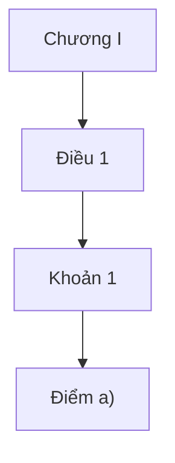

# UIT Law Database (Points Edition) — README

**Version:** points-split (Điều → Khoản → Điểm)  
**Database:** `uit_law_points.db`  
**Scope:** All ~26 PDFs (đã xử lý trùng số hiệu 547 theo tiêu đề khác nhau)

---

## 1) Mô tả nhanh

CSDL SQLite chứa toàn bộ quy định UIT, với cấu trúc **phân cấp**:
**Chương → (Mục → Tiểu mục) → Điều → Khoản → Điểm**  
(Trong bản này đã **tách đầy đủ Điều → Khoản → Điểm**; “Mục/Tiểu mục” sẽ có nếu văn bản có heading tương ứng)

Có **FTS5** để tìm kiếm toàn văn (`items_fts`), và **trigger** tự đồng bộ khi thêm/sửa/xóa `items`.

---

## 2) Các file đi kèm

- `uit_law_points.db` — **CSDL chính** (journal_mode=DELETE, chỉ 1 file).  
- `uit_law_mermaid_full.md` — Sơ đồ Mermaid **Chương → Điều → Khoản (→ Điểm)** cho **tất cả** văn bản.  
 -(Tuỳ chọn) `uit_law_toc_mermaid.md` — Mermaid gọn: **Chương → Điều**.  
- (Tuỳ chọn) `README_UIT_LAW_DB.md` — mô tả schema tổng quát (không bắt buộc nếu dùng file này).

---

## 3) Schema tóm tắt

### Bảng lõi

- **`documents`**: mỗi dòng = 1 văn bản.
  - `id` (uuid), `so_hieu`, `title`, `issued_date`, `effective_date`, `unit`, `status`, `checksum`, `created_at`, `updated_at`
  - Lưu ý: có thể tồn tại **nhiều văn bản cùng `so_hieu`** (ví dụ 547), phân biệt bằng **`title`** và **`checksum`**.

- **`items`**: nội dung phân cấp của mỗi văn bản.
  - `id`, `doc_id` (FK), `parent_id` (self-FK), `level` (`chuong | muc | tieumuc | dieu | khoan | diem | bullet | khac`),  
    `title` (VD: “Điều 10”, “Khoản 1”, “Điểm a)”), `heading`, `content`, `ordinal`, `path`, `created_at`, `updated_at`
  - Trong bản “points”, **Toàn bộ Điều đã được tách Khoản**; nơi có mẫu `a) b) c)` sẽ có thêm **Điểm**.

- **`sources`**: ánh xạ file nguồn PDF/scan (`file_name`, `file_path`, `pages`).

- **`attachments`**: đính kèm theo `item` (khoảng trang, OCR JSON).

- **`xrefs`**: tham chiếu chéo giữa các `item` / `so_hieu`.

- **`tags`, `item_tags`**: gắn nhãn chủ đề cho `item` (N–N).

### Tìm kiếm toàn văn (FTS5)

- **`items_fts`** (+ shadow tables) = chỉ mục `title | heading | content`.  
- Trigger `items_ai/items_au/items_ad` giữ đồng bộ với `items`.

### VIEW tiện tra cứu

- **`v_docs`**: danh mục văn bản + số `items` (`n_items`).  
- **`v_toc`**: mục lục (TOC) theo `path`, gồm `level/title/heading`.

---

## 4) Truy vấn ví dụ (copy chạy thẳng)

**4.1. Danh mục văn bản**
```sql
SELECT so_hieu, title, issued_date, status, n_items
FROM v_docs
ORDER BY issued_date DESC, so_hieu;
```

**4.2. Mục lục một văn bản (đổi số hiệu)**
```sql
SELECT level, title, heading, path
FROM v_toc
WHERE so_hieu='790/QĐ-ĐHCNTT'
ORDER BY path;
```

**4.3. Full-text search (cụm từ chính xác)**
```sql
SELECT d.so_hieu, i.level, i.title, i.heading
FROM items_fts f
JOIN items i ON i.rowid = f.rowid
JOIN documents d ON d.id = i.doc_id
WHERE f MATCH '"học phí"'
ORDER BY d.so_hieu, i.path;
```

**4.4. Đếm số lượng theo cấp**
```sql
SELECT level, COUNT(*) AS cnt
FROM items
GROUP BY level
ORDER BY cnt DESC;
```

**4.5. Cây Điều → Khoản → Điểm của một văn bản**
```sql
SELECT i.level, i.title, substr(i.content,1,120) AS preview, i.path
FROM items i
JOIN documents d ON d.id = i.doc_id
WHERE d.so_hieu='790/QĐ-ĐHCNTT'
ORDER BY i.path;
```

**4.6. Tìm nhanh các văn bản có cùng số hiệu (ví dụ 547)**
```sql
SELECT so_hieu, title
FROM documents
WHERE so_hieu LIKE '547/%';
```

---

## 5) Mermaid (mục lục dạng sơ đồ)

- File: `uit_law_mermaid_full.md`  
- Mỗi văn bản có 1 khối:
```md
## 790/QĐ-ĐHCNTT — Quy chế đào tạo...

- Mở trong VS Code (Markdown Preview Mermaid), Obsidian, Notion, GitHub… để nhìn cây.

> Muốn rút gọn chỉ tới **Khoản**, hoặc chỉ **Chương → Điều**, xem file `uit_law_toc_mermaid.md` hoặc liên hệ để xuất bản riêng.

---

## 6) Nguyên tắc tách mức (đã áp dụng)

- **Điều** → luôn tạo.  
- **Khoản**: nhận diện `1.`, `2.`, … hoặc `1)` → **tách**.  
- **Điểm**: nhận diện `a)`, `b)` → **tách** dưới Khoản.  
- **Gạch đầu dòng** (`-`, `•`, `–`):  
  - Nếu chỉ liệt kê/diễn giải → giữ trong `content` của Khoản/Điểm.  
  - Nếu là mệnh đề quy phạm độc lập cần trỏ tham chiếu → có thể tách thêm `level='bullet'` (tuỳ nhu cầu).

Regex chính:  
- Khoản: `^\s*(\d+)[\.\)]\s+`  
- Điểm: `^\s*([a-zA-Z])\)\s+`

---

## 7) Nhập văn bản mới / trùng số hiệu

- Cho phép **trùng `so_hieu`** (ví dụ cả hai văn bản **547**), nhưng **không trùng `checksum`** (nội dung y hệt sẽ bị bỏ qua).  
- Phân biệt bằng **`title`** (ví dụ: “Quy định đào tạo ngoại ngữ (547/…)” vs “Chính sách hỗ trợ công bố khoa học (547/…)”).

---

## 8) FAQ & lỗi thường gặp

- **Mở DB thấy rỗng?**  
  Dùng file `uit_law_points.db` (journal_mode=DELETE). Nếu dùng bản WAL, cần đi kèm `*.db-wal`.

- **Tìm không ra số hiệu** (ví dụ chỉ gõ `547`)?  
  `so_hieu` đầy đủ dạng `547/QĐ-...`. Dùng `LIKE '547/%'` hoặc `WHERE so_hieu LIKE '%547%'` để dò.

---

## 9) Ghi chú phiên bản

- Bản **points-split**: tăng cường phân rã tới **Khoản/Điểm**, cập nhật Mermaid full, thêm **547 (hỗ trợ công bố khoa học)** song song với **547 (ngoại ngữ)**.  
- FTS & triggers giữ nguyên, chỉ mục đồng bộ tự động.

---


